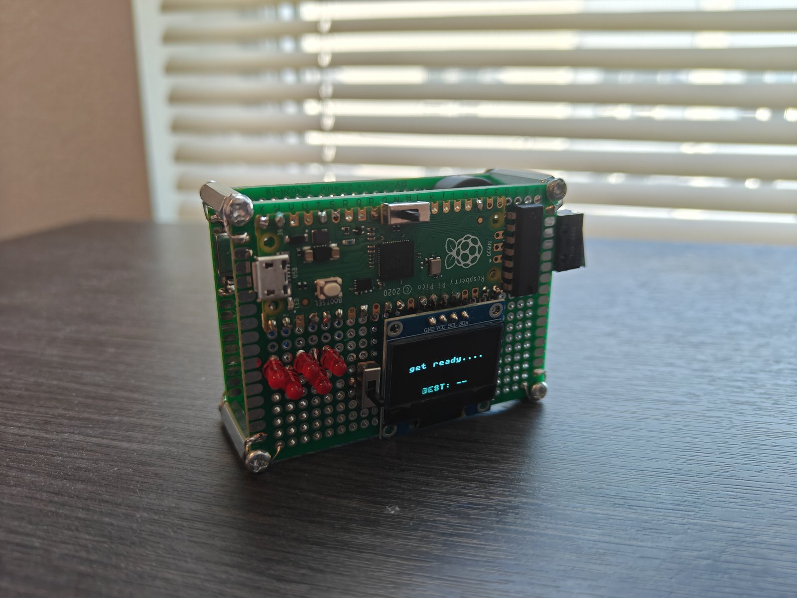
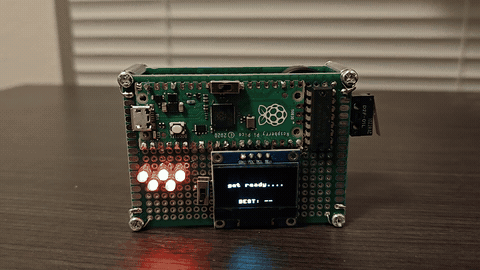
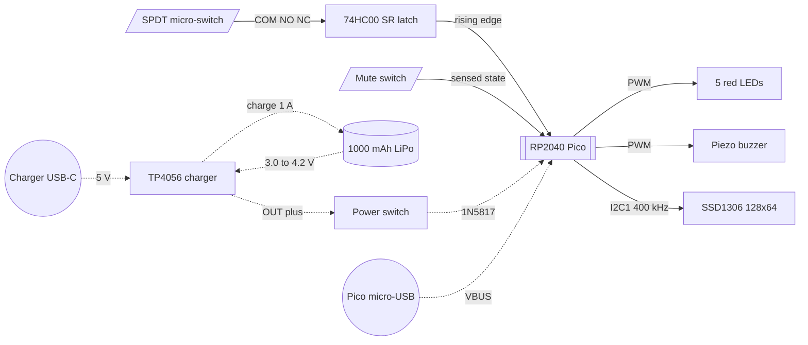

# Reaction Time Game

*A handheld reaction timer for Formula 1 fans: it runs the same five-light start sequence used at an F1 race start and measures reaction time in milliseconds.*



**Status:** Complete · **Platform:** Raspberry Pi Pico (RP2040), MicroPython ·
**Built with:** MicroPython, Thonny, 74HC00 discrete logic, handheld scope and multimeter ·
**Built:** June–August 2026

## Documentation

| File | What's in it |
|---|---|
| [hardware/README.md](hardware/README.md) | Full circuit design, component selection, construction |
| [hardware/interconnect.md](hardware/interconnect.md) | Signal-by-signal pin map |
| [firmware/notes.md](firmware/notes.md) | Module structure, algorithms, timing |
| [test/README.md](test/README.md) | Measurement setup, methodology, full results |
| [docs/design-decisions.md](docs/design-decisions.md) | Every decision made and rejected, with reasoning |
| [docs/lessons-learned.md](docs/lessons-learned.md) | What I learned building this |
| [docs/development-log.md](docs/development-log.md) | How the project actually unfolded |
| [docs/reaction-time-game-onepager.pdf](docs/reaction-time-game-onepager.pdf) | One-page printable summary |

Licensed MIT — see [LICENSE](LICENSE).

## What it does

Built for Formula 1 fans who want to test their reaction time against the start sequence drivers face at every race. Five red lights come on one second apart, hold, then go out together after a random 200–3000 ms delay. Lights-out starts a millisecond timer, a button press stops it, and the result appears on a small OLED screen; pressing early is flagged as a false start. It runs on a Raspberry Pi Pico, a microcontroller board built on the RP2040 chip, from a rechargeable battery. A discrete logic latch debounces the button in hardware, and the timer was checked against an oscilloscope: every reading landed within 10 ms.



*One round, recorded to show the sequence rather than a fast time: the hand comes in from outside the frame, so the press itself is visible. Measured reaction times are in the table above.*

## Results

| Metric | Value | Conditions | How measured |
|---|---|---|---|
| My reaction time on this device | median 202 ms, best 174 ms, range 174–260 ms (n = 30) | measured on myself: 30 consecutive rounds, seated, one sitting, fresh boot | read from the OLED after each round |
| My reaction time on the Human Benchmark web test | median 251 ms, best 228 ms (n = 30) | measured on myself in the same sitting, on a computer | read from the test's own display |
| Timer bias against an oscilloscope | device reads 4–10 ms high, mean +6.4 ms (n = 10) | FNIRSI 2C53T, 50 ms/div, cursor resolution about 4 ms | cursor interval from lights-out to the latch edge, compared with the displayed result |
| Contact bounce, raw switch | 6–11 transitions per press (7 presses) | same switch, same press action | GPIO transition count |
| Contact bounce, latch output | 1 transition per press (7 presses) | as above | GPIO transition count |
| Schottky forward drop under load | 0.278–0.286 V (4 readings) | game running on battery | cell voltage minus VSYS, measured at the pins |
| Battery gauge error | reads 39–62 mV above the cell (4 readings) | game running on battery | OLED estimate against a multimeter |
| VSYS with the switch off | 0.2 mV | USB disconnected | multimeter, VSYS to GND |

The timer bias is not corrected in firmware and is tracked as an open issue. Supply current, sleep current and charge time were never measured, so no runtime or charge-time figure appears anywhere in this repository.

## System architecture



At power-on the firmware seeds the random generator from hardware entropy, initialises the peripherals, and flashes the onboard LED for a second if it is on battery. Each round waits for a start press and its release, arms the button interrupt, then runs the light sequence. The interrupt fires once per press, and whether that press is a false start or a result depends only on whether the start timestamp has been taken.

## Hardware

The input is an Omron D2F-01L SPDT micro-switch, chosen because the SR latch needs a changeover contact and because its break-before-make wiper makes the latch's forbidden state unreachable. Two of the four NAND gates in an SN74HC00N form the latch, with 10 kΩ pull-ups on both inputs. Five red LEDs run from GP0–GP4 through 150 Ω resistors. Power comes from a 1000 mAh LiPo through a protected TP4056 Type-C charger, a slide switch in the load branch, and a 1N5817 Schottky that ORs the cell onto VSYS. The build is two 5×7 cm perfboards stacked on standoffs: the upper one carries the Pico, display, LEDs, latch and all three switches, the lower one the battery, charger and buzzer. A single board could not hold the parts and the wiring between them. Full analysis, every calculation and the layout reasoning are in [hardware/README.md](hardware/README.md).

## Firmware

MicroPython, one 376-line `main.py`. The button is captured by a rising-edge interrupt armed only for the duration of a round, so a press during the blocking light sequence is never missed, and the same handler separates a false start from a result by checking whether the start timestamp exists. Sleeps poll in 5 ms steps so a false start aborts within about 5 ms, and tones are stepped by a one-shot timer so sound never blocks the game. Module structure, the timing chain and the measured bias are in [firmware/notes.md](firmware/notes.md). The firmware was written with AI assistance.

## Design decisions

- **Hardware SR latch over software debounce.** Two NAND gates return one clean edge with gate-propagation delay only, where an RC filter adds 1–3 ms to every timestamp on a device whose purpose is timing.
- **SPDT micro-switch over a tactile button.** An SR-latch debouncer needs COM, NO and NC contacts. A single-throw button has nothing for the latch to hold state against.
- **RP2040 over an ESP32.** One 3.3 V domain matching the 74HC00 and the OLED, built-in VBUS and VSYS sensing for the gauge, no strapping pins to trap a hand-wired board, no need for a radio.
- **1000 mAh cell over 500 mAh.** Its 1C charge rate equals the TP4056's stock 1 A, so no SMD program resistor had to be swapped on a $2 module.
- **Charging through the charger's own USB-C with the switch off.** The cell charges with no load attached, which keeps termination clean, and the device is genuinely off while charging.

Every decision, including the rejected paths, is in [docs/design-decisions.md](docs/design-decisions.md).

## Problems solved

- **OLED refused to initialise.** `I2C(0, scl=Pin(15), sda=Pin(18))` raised `ValueError: bad SCL pin`. The RP2040 hard-maps each I²C controller to a fixed pin set, and GP15/GP18 belong to block 1. Changing the block index fixed it; the build uses I²C1 on GP11 and GP14.
- **The same hold pattern every power-up.** Times looked suspiciously fast and repeatable. MicroPython's `random` is deterministic until seeded, and the Pico has no clock to seed from. Seeding once at boot from `os.urandom(4)`, which draws on the chip's ring oscillator, fixed it.
- **Intermittent "LOW BATTERY" during assembly.** With the battery half soldered in, the device came on with the switch off, showed the warning, and would not restart on a quick flick. A freshly charged cell sits far above the 3.4 V threshold, so the gauge had to be losing the battery momentarily. Heavier wire and a reworked joint on the charger-to-Pico ground ended both symptoms, which have not recurred. The exact joint was never isolated.

## What I learned

- An SR-latch debouncer only works with a changeover switch, for a mechanical reason: the wiper breaks before it makes, so the reset path is unavailable while the set contact bounces.
- A diode's forward drop is a function of current, not a constant. The same 1N5817 read 0.010 V with only a voltmeter across it and 0.278–0.286 V with the game running.
- The RP2040's two I²C controllers are pin-locked: a valid SDA/SCL pair must come from the same block.
- Timing resolution is not timing accuracy. Millisecond timestamps and a scheduled interrupt handler put this instrument's floor in milliseconds, which the scope comparison confirmed at +6.4 ms.

## What I'd do differently

- Replace the voltage-based gauge with a MAX17048 on the existing I²C bus for a true state-of-charge reading.
- Replace the main loop's unbounded busy-wait on the press, and sample battery and mute state at more points in the round instead of only on the static screens.
- Move the build to a PCB for compactness rather than two stacked perfboards.
- Swap the TP4056 program resistor to charge at 0.5C, which is easier on a small pouch cell than charging at its rated ceiling.

## Repository layout

```
reaction-time-game/
├── README.md
├── LICENSE                       # MIT
├── .gitignore
├── hardware/
│   ├── README.md                 # full design writeup
│   ├── interconnect.md           # signal-by-signal pin map
│   ├── bom.csv                   # parts, quantities, prices as paid
│   ├── schematic.pdf             # drawn from the confirmed netlist
│   ├── schematic-excerpt.png     # SR-latch and power-path detail
│   └── wiring-diagram.png        # perfboard connections
├── firmware/
│   ├── README.md                 # dependencies, flashing, running
│   ├── notes.md                  # design depth
│   └── src/
│       ├── main.py               # the game
│       └── cinema.py             # optional long animation
├── test/
│   ├── README.md                 # methods and full results
│   ├── bounce-count.py           # the transition-counting script
│   ├── comparison-01.png         # raw contact vs latch output
│   ├── measurement-01.png        # contact transition detail
│   └── measurement-02.png        # lights-out to latch edge
├── docs/
│   ├── design-decisions.md
│   ├── lessons-learned.md
│   ├── development-log.md
│   └── reaction-time-game-onepager.pdf
└── media/
    ├── hero.jpg
    ├── demo.gif
    ├── bench-setup.jpg
    └── detail-01.jpg … detail-06.jpg
```

## Build and reproduce

Parts are in [hardware/bom.csv](hardware/bom.csv) and every connection in [hardware/interconnect.md](hardware/interconnect.md), where the latch is listed pin by pin — the one part that is easy to get wrong. Flash a Pico with MicroPython v1.28.0 or newer, install the `ssd1306` driver, and copy `firmware/src/main.py` to the board as `main.py`; `cinema.py` is optional. Full steps are in [firmware/README.md](firmware/README.md). The bring-up order that worked: LEDs, OLED, button and latch, then the power subsystem on its own bench, then the buzzer.
