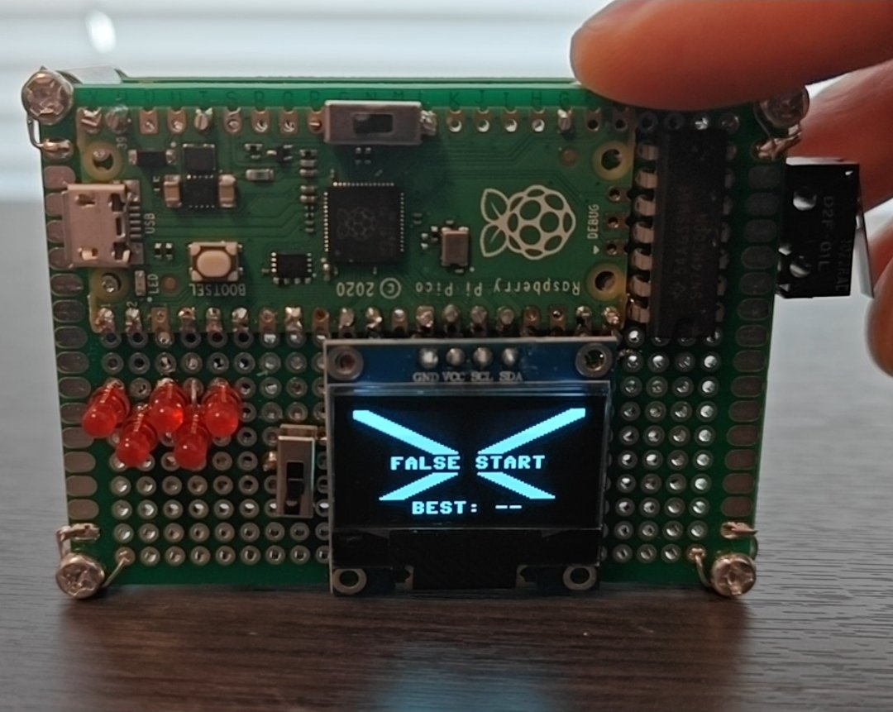
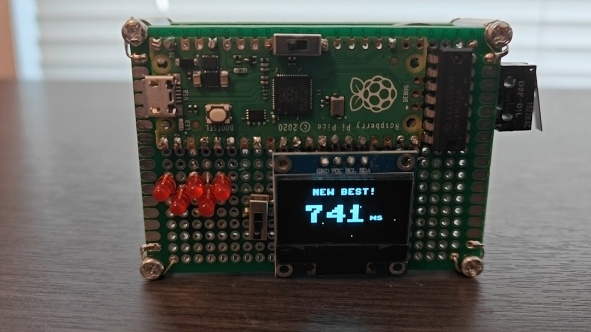

# Firmware notes

MicroPython, one 376-line `main.py` plus an optional animation module. The interesting parts are the capture path, the timing chain and what the scope said about it.

## Modules

| File | Responsibility | Size |
|---|---|---|
| `main.py` | hardware init, power sensing, button ISR, light sequence, false-start handling, result and best display, short new-best animation, sound, main loop | 376 lines |
| `cinema.py` | optional long-form animation played only on a new best under 100 ms | about 2500 lines |
| `ssd1306.py` | SSD1306 driver, installed on the board, not part of this repository | library |

## Capture path

The button is on a rising-edge interrupt that is armed just before the light sequence and disarmed as soon as the round's answer is captured:

```python
button.irq(handler=press_detected, trigger=pin.IRQ_RISING)
```

Interrupt rather than polling, because the light sequence blocks between LEDs: a polled loop would either miss a press or force the sequence into a state machine.

The handler carries all the round's logic in four lines:

```python
def press_detected(_):
    global false_start, time_of_press
    if time_of_start == 0:
        false_start = True
    else:
        time_of_press = time.ticks_ms()
```

If the start timestamp does not exist yet, the lights are still on and the press is a false start. Otherwise it is the answer. There is no formal state machine: which meaning a press carries is tracked by which section of linear code is running and whether the interrupt is armed. That is a deliberate choice for a game with one button and three phases, and it is the part I would revisit first if a second button were ever added.

Because the latch debounces in hardware, the interrupt fires exactly once per press. No lockout, no re-sampling, no debounce code anywhere in the file.

## Timing chain, and what it actually measures

The stimulus is stamped at the end of `sequence()`, immediately after the LEDs are commanded off:

```python
all_off()
time_of_start = time.ticks_ms()
```

and the press is stamped inside the handler. The result is `time.ticks_diff(time_of_press, time_of_start)`.

Measured against an oscilloscope over ten rounds, the device reads 4 to 10 ms high, mean +6.4 ms, against the cursor interval from lights-out to the latch edge. The full table is in [../test/README.md](../test/README.md). The bias is systematic and in one direction, but its cause has not been isolated. Three candidates, none of them tested:

- `Pin.irq` defaults to a scheduled handler, so `ticks_ms()` runs when the interpreter next gets control, not at the electrical edge.
- The RP2040 latches a new PWM duty at the end of the current period, so at 1 kHz the LEDs can stay lit for up to 1 ms after `all_off()` returns and the stamp is taken.
- Cursor placement on a handheld scope at 50 ms/div resolves to roughly 4 ms, which covers part of the spread but not a consistent one-way offset.

`ticks_ms` also puts a 1 ms floor under the whole thing. This instrument is millisecond-resolution with a characterised bias, not the microsecond-scale chain the early design notes assumed. Against human round-to-round spread of about 20 ms the bias does not change how the game plays, but it changes what the number means. Correcting it is tracked as an open issue; the fix path is a hard interrupt and a microsecond timestamp.

## Sequence and hold

```python
for led in leds:
    wait_ms(S_INTERVAL)      # 1000 ms
    led.duty_u16(LED_BRIGHT)
wait_ms(hold)                # random 200-3000 ms
all_off()
```

The one-second cadence and the 200–3000 ms hold copy the Formula 1 start procedure directly. `wait_ms` polls in 5 ms steps and returns early if the false-start flag is set, so a cheat aborts the round within about 5 ms instead of at the end of a blocking sleep.

An earlier attempt detected false starts by checking whether the computed interval was negative or zero. It cannot be, and the approach risked a hang; watching for an edge during the pre-go window replaced it.

## Random hold

```python
random.seed(int.from_bytes(os.urandom(4), "little"))
```

Seeded once at boot. Without it, MicroPython's generator replays the same hold sequence on every power-up, which showed up as suspiciously fast, repeatable times once the pattern became learnable. The Pico has no real-time clock, so a wall-clock seed is not available; `os.urandom` draws on the chip's ring oscillator.

## Sound

Tones are stepped by a one-shot `machine.Timer`. `play_notes()` starts the first note and returns immediately, and the callback re-arms the timer for each following note. The earlier blocking version called `time.sleep_ms` per note, which froze the game for the length of every sound.

| Event | Notes |
|---|---|
| Round start | 1200 Hz, 50 ms |
| False start | 220 Hz 180 ms, 20 ms rest, 150 Hz 320 ms |
| New best | 523 / 659 / 784 Hz at 130 ms each with 20 ms rests, then 1046 Hz for 340 ms |

Duty is 24000/65535 while a note sounds, and zero between notes. The tones sit well below the transducer's 4 kHz resonance, which keeps them quiet on purpose. No tone plays inside the measurement window.

## Power and battery

`on_usb()` reads the VBUS sense pin. `battery_volts()` averages eight ADC samples of VSYS ÷ 3, converts, and adds 0.3 V for the Schottky drop. `battery_critical()` is true only on battery and below 3.4 V, and is checked at the top of every round, which covers both booting on a flat cell and running one down mid-session. The warning blinks the LEDs and the display three times and then calls `machine.deepsleep()`.

The estimate reads 39–62 mV above the true cell voltage, measured at four charge states; the calibration table is in the test notes. The display shows three coarse buckets rather than a percentage, which is the resolution this method honestly supports.

## Display

The built-in font is 8 px and fixed. `scaled_text()` renders a string into a small framebuffer, reads it pixel by pixel, and draws an N×N block per lit pixel, which gives integer-scaled large text with no font library. At scale 3 a line holds five characters, which is what the result screen needs.





Status icons are drawn only on the static screens, not inside animations: a USB or battery icon at top right, a speaker or muted speaker at top left, positioned next to the physical mute switch.

## Animations

The false-start screen shakes a thick X against full-screen white slams, then settles with the label and the best-time footer. The short new-best animation runs a muzzle flash, a bullet with a trail, an expanding fireball with shrapnel, a rotating starburst and a sparkle reveal of the number, built entirely from framebuffer primitives.

`cinema.py` is a separate, much longer animation gated behind `CINEMA_UNDER = 100`, so it only plays on a new best faster than 100 ms. That threshold is deliberate: under 100 ms is treated as a guess rather than a reaction in sprint starting, so the long animation is an easter egg for an impossible time rather than a game feature. It was written by AI end to end as an experiment in what could be drawn on a 1-bit 128×64 display, under my direction; it is included because it runs on the device, and it is not offered as an example of my own code. It is imported inside a `try`/`except` and the game is unaffected if it is absent.

## Configuration

| Constant | Value | Why |
|---|---|---|
| `S_INTERVAL` | 1000 ms | the Formula 1 cadence |
| hold range | 200–3000 ms | the Formula 1 hold |
| `CINEMA_UNDER` | 100 ms | the threshold below which a reaction is a guess |
| `POST_ROUND_MS` | 2500 ms | tuned by feel: long enough to read the result, short enough not to stall the game |
| `LED_BRIGHT` | 2000/65535 | the lowest setting that is still comfortable to look at |
| `BATT_FULL / BATT_HALF / BATT_CRIT` | 3.9 / 3.6 / 3.4 V | icon buckets and the shutdown point, as estimated cell volts |
| `BEST` | 100000 | session-best sentinel, so the first round always registers |

The session best lives in RAM and resets at power-off. Flash persistence was scoped and dropped: a lucky sub-50 ms result would have been stored forever and made every later session pointless, and writing to flash brings wear and crash-safety concerns for no gain here.

## Authorship

The firmware was written with AI assistance.

## Known limitations

- The main loop busy-waits on the press with `while time_of_press == 0: pass`, with no timeout and no battery or mute check during the wait.
- The measured +6.4 ms timing bias is uncorrected.
- Large text is integer-scaled and blocky; a proportional font would need a font-conversion tool.
- The battery estimate is coarse and its diode offset is a constant where the real drop varies with load.
- `BTN_IDLE` samples the button at boot, so holding the button down while powering on inverts the sense of "pressed".
- Deep sleep only clears on a clean power cycle, and board capacitance holds the rail up for a second or two after the switch opens.
