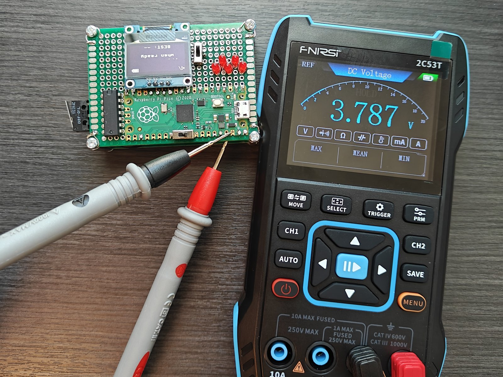

# Test and measurement

Every number published in this repository comes from one of the tests below, or from a calculation that is shown in full in [../hardware/README.md](../hardware/README.md). Where something was not measured, it is listed as not measured rather than estimated.

## Instruments

| Instrument | Used for | Settings recorded with each result |
|---|---|---|
| FNIRSI 2C53T, 2-channel handheld oscilloscope, ×1 probes | contact transitions, lights-out to press interval | timebase, V/div, coupling, trigger mode |
| FNIRSI 2C53T multimeter mode | DC volts on the power path and across a LED resistor | DC volts, autorange |
| The RP2040 itself, running [bounce-count.py](bounce-count.py) | counting transitions on the latch output and the raw contact | script included in this folder |

## 1. Contact bounce: raw contact against latch output

**Why.** The SR latch is the central design choice of the project. Until this test, the claim that it returns one clean edge rested on the game working end to end.

**Result.** Seven presses, counted on both nodes at once:

| Press | Raw contact transitions | Latch output transitions |
|---|---|---|
| 1 | 9 | 1 |
| 2 | 6 | 1 |
| 3 | 11 | 1 |
| 4 | 9 | 1 |
| 5 | 10 | 1 |
| 6 | 11 | 1 |
| 7 | 10 | 1 |

Every press produced between 6 and 11 transitions on the raw contact and exactly one on the latch output. That is the whole argument for the latch, measured rather than assumed.

**Method.** [`bounce-count.py`](bounce-count.py) attaches an interrupt to both edges of two pins and counts transitions: one pin on 74HC00 pin 1, the raw NO contact node, and one on pin 3, the latch output. When either pin moves, the script waits 40 ms for the bounce train to finish, prints both counts, then waits for the release and another 40 ms before arming again. Both counters are plain increments in the handlers, so a missed count would understate the raw contact, never the latch.

The test ran on the breadboard, on GP6 and GP7 rather than the build's GP15. The latch circuit is identical: the same SN74HC00N, the same two 10 kΩ pull-ups and the same micro-switch, wired as in [interconnect.md](../hardware/interconnect.md).

## 2. Contact transition detail

A two-channel capture of the wiper changing over at 500 µs/div. Channel 1 sits on 74HC00 pin 1, the NO contact driving /S; channel 2 on pin 4, the NC contact driving /R. Both are DC-coupled, so the traces are the contact states directly.

**Result.** On the transition captured here the NO contact opens and the NC contact closes **940 µs later**, and the two are never closed at the same time. That gap is what makes the latch's forbidden state unreachable, and it is why bounce on the closing contact — visible as the narrow spikes on channel 2 — cannot reach the latch's reset path. The same mechanism runs in reverse on the press.

Settings: FNIRSI 2C53T, 500 µs/div, 1 V/div both channels, both DC-coupled, ×1 probes, single-shot trigger.

## 3. Timing: device reading against oscilloscope interval

**Why.** The device's output is a time, so the open question is what that time is measured against.

**Method.** Channel 1 on GP0, the first LED's drive pin. Channel 2 on GP15, the latch output. Timebase 50 ms/div, single-shot, triggered on the latch edge with the trigger point late on screen so lights-out stays visible. Cursors placed at the last LED pulse and at the latch edge; the cursor interval was written down together with the value the OLED displayed for that same round. Ten rounds.

Settings: FNIRSI 2C53T, 50 ms/div, channel 1 20 mV/div AC-coupled, channel 2 500 mV/div DC-coupled, ×1 probes, single-shot.

| Round | Device (ms) | Oscilloscope (ms) | Difference (ms) |
|---|---|---|---|
| 1 | 222 | 216 | +6 |
| 2 | 256 | 248 | +8 |
| 3 | 214 | 204 | +10 |
| 4 | 208 | 200 | +8 |
| 5 | 206 | 200 | +6 |
| 6 | 200 | 192 | +8 |
| 7 | 160 | 156 | +4 |
| 8 | 201 | 196 | +5 |
| 9 | 184 | 180 | +4 |
| 10 | 187 | 182 | +5 |

**Result.** The device reads high in every round, by 4 to 10 ms, mean +6.4 ms, standard deviation 2.0 ms. Cursor placement at this timebase resolves to about 4 ms, which accounts for part of the spread but not for a consistent one-way offset. The bias is uncorrected in firmware and is tracked as an open issue; candidate causes are listed in [../firmware/notes.md](../firmware/notes.md).

## 4. Reaction-time session

**Method.** One player, one sitting, fresh boot, 30 consecutive rounds, every result written down including the slow ones. The same player then ran 30 rounds of the Human Benchmark reaction test on a computer in the same sitting.

| | Device | Human Benchmark |
|---|---|---|
| Rounds | 30 | 30 |
| Best | 174 ms | 228 ms |
| Median | 202 ms | 251 ms |
| Mean | 204 ms | 255 ms |
| Standard deviation | 20 ms | 19 ms |
| Range | 174–260 ms | 228–305 ms |

The medians differ by 49 ms, and the device's own +6.4 ms bias from test 3 widens that to about 55 ms once removed. The mechanism behind the gap is the measurement chain, not the player: a computer test adds display pipeline and input-stack latency between the stimulus and the recorded press, where this device's chain is an LED, a latch and an interrupt. How much each contributes was not measured here, so the comparison is published as two distributions taken in one sitting, not as a latency figure for the computer.

## 5. Battery gauge calibration

**Method.** A throwaway script replaced `main.py` and displayed the raw ADC conversion on the OLED, since the reading is only valid on battery and the REPL needs USB, which switches VSYS to the USB rail. At each point the OLED values were read and the cell and VSYS were measured at the pins with the meter. Four points across two days of running the device down.

| Point | OLED VSYS (V) | OLED estimate (V) | Meter VSYS (V) | Meter cell (V) | Estimate error (V) | Implied diode drop (V) |
|---|---|---|---|---|---|---|
| Fresh off charger | 3.77 | 4.07 | 3.745 | 4.031 | +0.039 | 0.286 |
| After the session in test 4 | 3.77 | 4.07 | 3.749 | 4.029 | +0.041 | 0.280 |
| After several hours on | 3.73 | 4.03 | 3.708 | 3.986 | +0.044 | 0.278 |
| After several more hours on | 3.69 | 3.99 | 3.649 | 3.928 | +0.062 | 0.279 |

**Result.** The ADC path itself reads 21–41 mV above the meter, and the displayed estimate reads 39–62 mV above the true cell, because the firmware adds a fixed 0.3 V for a diode that actually drops 0.278–0.286 V under this load. The error is one-sided and small next to the 0.2–0.3 V icon buckets. Its practical consequence is that the 3.4 V shutdown fires at a true cell voltage near 3.34 V.

The same four readings answer a question the design notes left open: the Schottky drop with the game running is 0.28 V, against 0.010 V measured with nothing but a voltmeter across the same diode.

## 6. True-off verification

With USB disconnected and the power switch open, VSYS to ground reads 0.2 mV. The switch genuinely disconnects the load branch. It is not a master cutoff when the Pico's own micro-USB is connected, because VBUS reaches VSYS through the Pico's onboard diode.

## 7. LED drive current

With the game running, the voltage across one 150 Ω LED resistor measured 32.5 mV, which is an average current of 0.217 mA per LED. The calculated value for the PWM duty in use is 0.265 mA. See [../hardware/README.md](../hardware/README.md) for the calculation and the likely reason for the 18 % gap.

## 8. Charge subsystem, tested on its own

Run before the charger was connected to anything downstream: cell on B+/B−, a wall adapter into the module's USB-C, meter on OUT+/OUT−.

| Stage | OUT+ | Status LED |
|---|---|---|
| Mid-charge | 4.026 V | red |
| Constant-voltage phase | 4.205 V | red |
| Later in the tail | 4.217 V | red |
| Termination | 4.192 V | flipped to blue |
| Five minutes off the charger | 4.175 V | — |

A clean constant-current to constant-voltage to termination cycle, inside the charger's 4.2 V ±1 % window throughout. The 17 mV settle after the charger is removed is surface charge relaxing, which is why the gauge is calibrated against the resting voltage rather than the charger-held one.

## Pass/fail summary

| Test | Result |
|---|---|
| Raw contact bounces, latch output does not | Pass, 7 presses |
| Break-before-make changeover | Pass, 940 µs of open circuit between the contacts |
| Timer agrees with an oscilloscope | Fail as an absolute timer: +6.4 ms mean bias, tracked as an open issue |
| Game plays end to end on battery, with sound and mute | Pass |
| Charging works through the module's USB-C with the switch off | Pass |
| Power switch gives a true off | Pass, 0.2 mV at VSYS |
| Battery gauge tracks the cell | Pass within 62 mV across four points |
| Charge cycle terminates correctly | Pass |
| Supply current, sleep current, runtime, charge time | Not measured |
