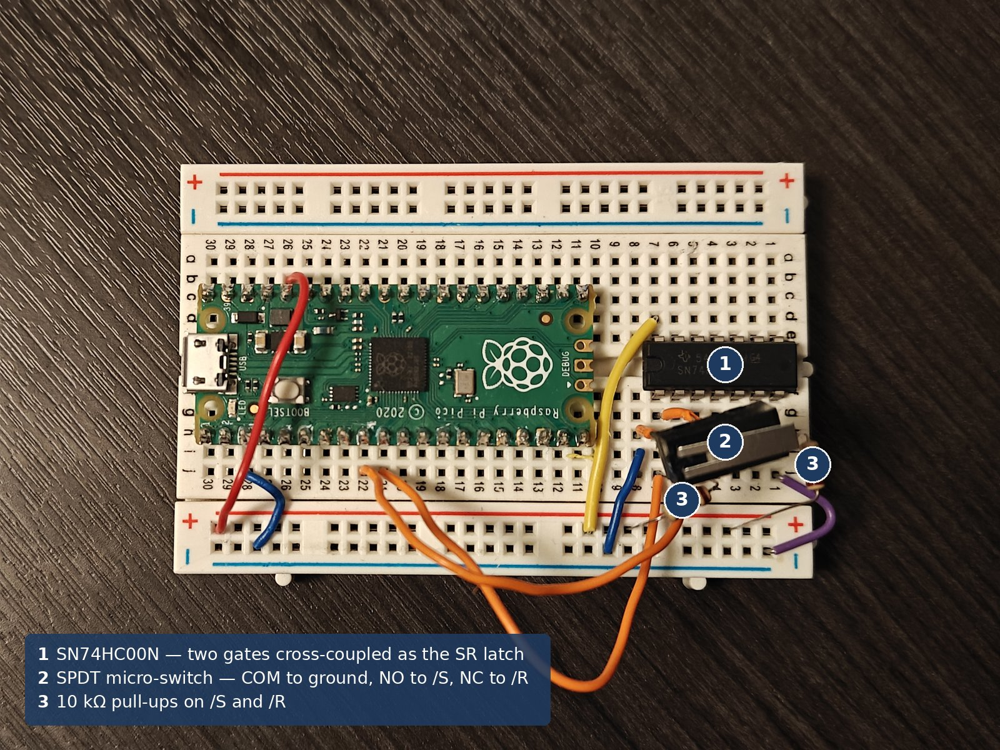
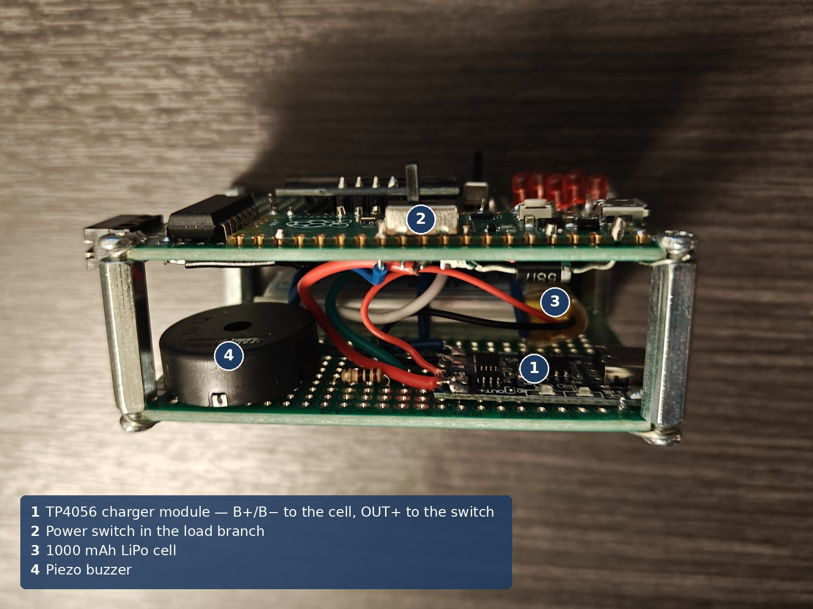
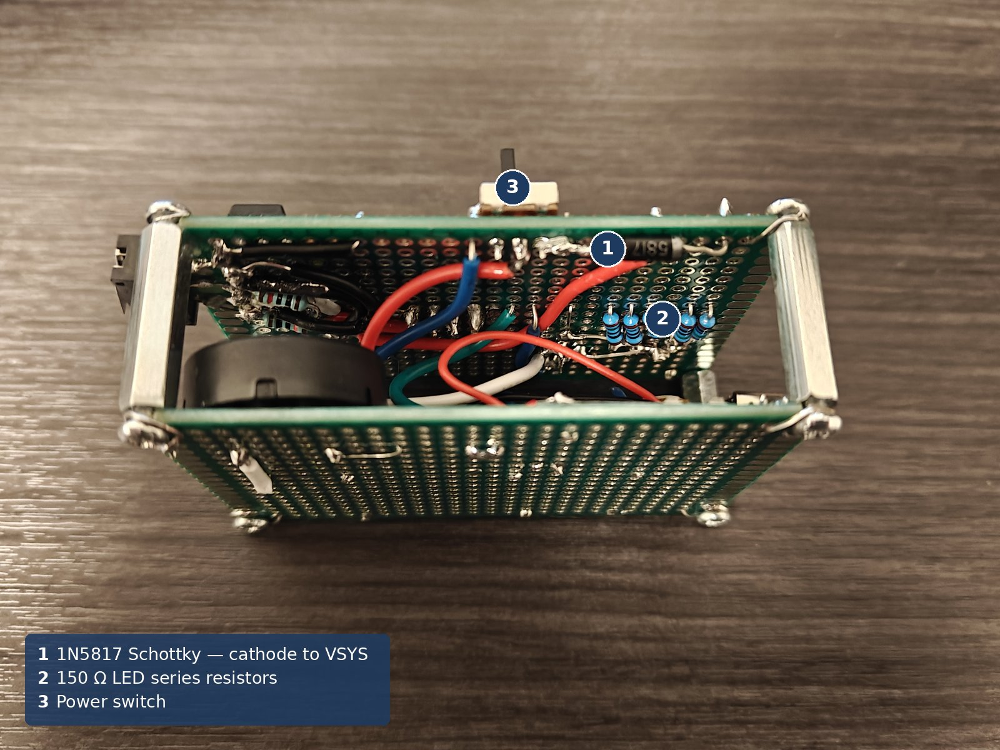
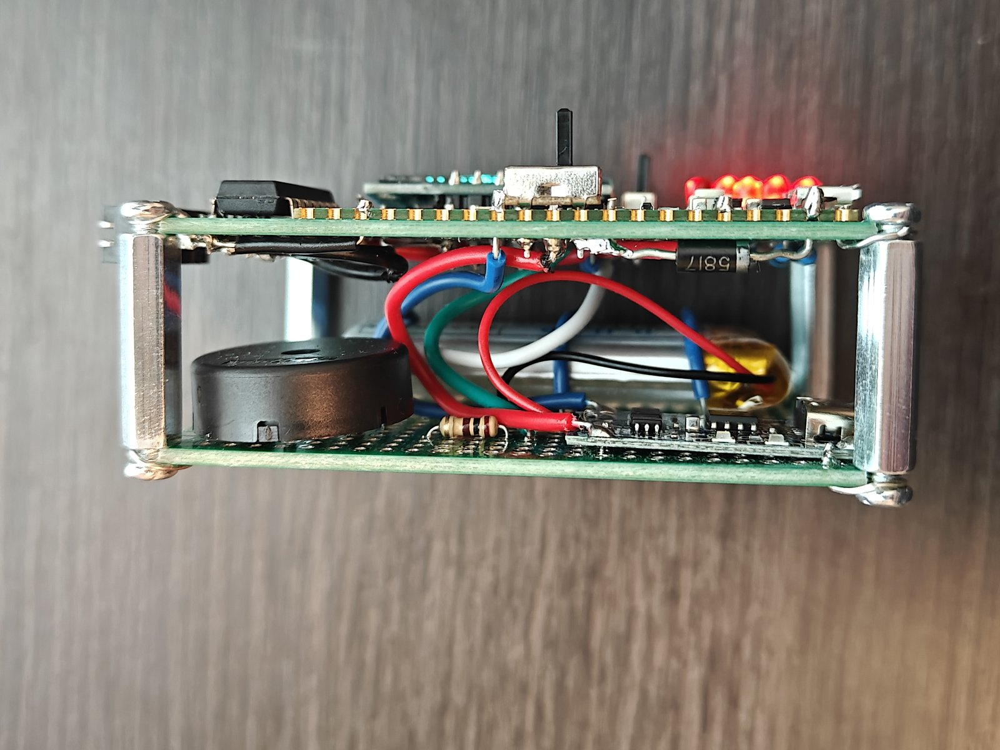

# Hardware

The device measures the interval between a visual stimulus and a button press, so the input path was chosen for what it does to that interval; the rest exists to make the instrument usable away from a bench. Everything runs in one 3.3 V domain, so nothing needs level shifting.

## Architecture

Four subsystems sit on two stacked perfboards: an SPDT micro-switch into a discrete SR latch; five PWM LEDs, an SSD1306 OLED on I²C1 and a piezo with a hardware mute; a 1000 mAh LiPo behind a protected TP4056, a load-branch switch and a Schottky onto VSYS; and the Pico's own VBUS sense and VSYS ÷ 3 ADC.

Connections are in [interconnect.md](interconnect.md), the drawn schematic in [schematic.pdf](schematic.pdf) with the latch and power path enlarged in [schematic-excerpt.png](schematic-excerpt.png), and the perfboard wiring in [wiring-diagram.png](wiring-diagram.png).

## Debounce: discrete SR latch (74HC00, gates 1 and 2)

A mechanical contact chatters for a few milliseconds as it closes. For a counter that costs a wrong count; for a timer it costs either a wrong timestamp or a firmware delay that shifts every measurement.

Two cross-coupled NAND gates form a set-reset latch with active-low inputs. The switch COM sits at ground, NO drives /S, NC drives /R, and both inputs are pulled to 3V3 through 10 kΩ. At rest the wiper holds NC low and Q is low. A press lifts NC first and lands on NO, and Q rises once. During NO-contact bounce /S only alternates between set and hold, both of which keep Q high, and the wiper physically cannot return to NC to reset the latch. The forbidden state, both inputs low, is unreachable for the same mechanical reason.

The cost is one 14-pin package, two resistors and a changeover switch, for a gate's propagation delay on the edge and no debounce code at all.

**Pull-up sizing [CALCULATED].** With 74HC input leakage of at most 1 µA, a 10 kΩ pull-up holds the input at 3.3 − (1 µA)(10 kΩ) = 3.29 V, which is 0.98 V above the 2.31 V threshold at Vcc = 3.3 V. With the wiper closed it passes 0.33 mA, trivial for a micro-switch. With about 50 pF of node capacitance, τ = 0.5 µs and the node reaches a valid high in about 1.1 µs, inside the roughly 10 µs shortest bounce gap. 1 kΩ wastes current, 100 kΩ settles too slowly.

**Latch output into the Pico [CALCULATED].** A lightly loaded 74HC output sits near 3.2 V high and 0.1 V low, leaving 1.2 V and 0.7 V of margin against the RP2040's 2.0 V and 0.8 V thresholds.

Measured [../test/README.md](../test/README.md): the raw contact produced 6 to 11 transitions per press and the latch output exactly one; and the wiper leaves one contact 940 µs before it reaches the other, so the two are never closed together. The circuit shown above is the one that was characterised on the breadboard, and it is identical on the board, on different pins.

## Start lights: five LEDs on PWM

Each 3 mm LED runs from a GPIO through a 150 Ω resistor to ground. Red suited both the theme and the electronics: Formula 1 start lights are red, and on 3.3 V a red LED's 2.0 V forward drop leaves usable headroom where blue or true green would barely light.

**Series resistor [CALCULATED].** R = (3.3 − 2.0) / 0.010 = 130 Ω for a 10 mA target, so the nearest standard value, 150 Ω, gives 8.7 mA. All five on is 43 mA, inside the chip's aggregate budget.

At full drive the LEDs were uncomfortable to look at, so they are dimmed by PWM at 1 kHz with a duty of 2000/65535, about 3 %, rather than by changing resistors. Peak current and resistor are unchanged; the eye averages the pulses.

**Predicted against measured.** Calculated average per LED: 8.7 mA × 2000/65535 = 0.265 mA. Measured across one 150 Ω resistor with the game running: 32.5 mV, or 0.217 mA, about 18 % low. The likely reason is the default 4 mA drive strength, which lets the output sag at a demanded 8.7 mA peak; that has not been isolated, and 8.7 mA is a calculated ideal rather than a measured peak.

## Buzzer

The piezo is externally driven, so the PWM frequency sets the pitch where an active buzzer would give one fixed tone. It is capacitive and draws a few milliamps, so a GPIO drives it directly with no transistor or flyback diode.

**Series resistor [CALCULATED].** With about 20 nF of piezo capacitance, 100 Ω limits each PWM edge to 33 mA peak, decaying with a 2 µs time constant, and puts the corner near 80 kHz, far above the tones. The resistor protects the pin, not the buzzer.

Mute is a slide switch in the piezo's ground leg; PWM into an open circuit is harmless. Its spare throw feeds GP7, so the firmware can draw the icon without having any control over the mute itself.

## Power path

The cell feeds TP4056 B+/B−. The charger's protected OUT+ runs through the power switch to a 1N5817 anode, and its cathode to Pico VSYS. Charging is done through the charger module's own USB-C with the switch off.

That removes the need for a power-path controller. With USB present the Pico's onboard D1 carries the load from VBUS while the charger works on the cell alone, so termination never sees a load; with the switch off there is no load at all.

**Schottky choice [CALCULATED, with measurement].** A silicon diode's 0.7 V would waste twice the headroom on a cell that only spans 3.0–4.2 V. Worst case, an empty 3.0 V cell leaves VSYS near 2.7 V, above the buck-boost's 1.8 V minimum. Measured with the game running: 0.278–0.286 V across four readings, which confirms the assumption in that check. The same diode read 0.010 V with only a voltmeter across it, because a meter draws microamps and forward voltage falls with current.

**True off [MEASURED].** With USB disconnected and the switch open, VSYS reads 0.2 mV: the load branch is open, so it carries no current. The cell itself is still connected to the charger's B+/B− pads, and that protection circuitry draws its own quiescent current, which was not measured — so this is a true off for the game, not a measured zero for the cell. It is also not a master cutoff when the Pico's own micro-USB is plugged in, since VBUS reaches VSYS through D1 regardless.

## Charging

The TP4056 charges at constant current, then constant voltage, terminating near one tenth of the charge current. The dual-protection variant adds a DW01A and FS8205 layer, redundant with the cell's own board and kept for that reason.

Charge current is set by the module's program resistor, roughly I = 1200 / R(kΩ) in milliamps, and the stock board ships at about 1 A. A 1000 mAh cell rated 1C accepts exactly that, so no SMD rework was needed, which is also why this cell was chosen over a 500 mAh one. The tradeoff is charging at the cell's ceiling rather than inside it, so the module sits where the resistor can still be swapped.

A full cycle was verified with the subsystem on its own: 4.026 V mid-charge, 4.205 V and 4.217 V through the constant-voltage tail, termination at 4.192 V as the status LED flipped to blue, and 4.175 V five minutes later once surface charge had relaxed.

## Battery sensing

The Pico brings VSYS out through an internal divide-by-three to ADC3 on GP29, and VBUS presence on GP24. Since charging happens with the switch off, the device runs on battery whenever it is on, so VSYS tracks the cell minus the Schottky drop.

The firmware averages eight samples, converts with VSYS = raw / 65535 × 3.3 × 3, and adds a fixed 0.3 V for the diode. Measured at four charge states, the estimate reads 39–62 mV high — the direction a fixed back-add predicts, since the true drop is under 0.3 V — which is well inside the 0.2–0.3 V display buckets and puts the 3.4 V shutdown near a true 3.34 V. A MAX17048 was selected first and abandoned when it went out of stock; it remains a drop-in upgrade on the existing bus.

## Current budget

| Rail | Voltage | Source | Feeds |
|---|---|---|---|
| Charger USB-C 5 V | 5 V | wall adapter | TP4056 only, with the switch off |
| Pico micro-USB 5 V | 5 V | PC | VBUS → D1 → VSYS |
| Battery | 3.0–4.2 V | 1000 mAh LiPo via TP4056 OUT+ | switch → 1N5817 → VSYS |
| VSYS | 1.8–5.5 V accepted | whichever source is higher | RP2040 buck-boost |
| 3V3(OUT) | 3.3 V | RP2040 buck-boost | 74HC00, both pull-ups, OLED |

Supply current was never measured: the cell's leads are soldered to the charger pads, and breaking that joint for a meter was judged more likely to damage the build than the reading was worth. A runtime figure would therefore rest on an estimate, so none appears anywhere in this repository. Measuring it is tracked as an open issue.

## Construction

The design was proven on a breadboard, then moved to perfboard. Two boards stack on standoffs — the upper carries the Pico, OLED, 74HC00, five LEDs and all three switches, the lower the battery, charger and buzzer — because a single board could not hold the parts and the wiring between them.

The bare Pico is soldered flat to the upper board, each lead entering the same hole as the pad it shares a net with. Socketing hedges against an unproven layout, and the breadboard had already removed that risk; the cost is that removing the Pico means heating about 40 joints without lifting pads.

Three layout rules were followed: related parts clustered so a future change is local surgery; the TP4056 left accessible for the program-resistor swap; and every ground returning to one star node at TP4056 OUT−, since a split ground is a quiet killer on a diode-OR supply. The perfboard holes were too small for the standoff screws, so the corners were cut off and a loop of wire soldered around each to form a mounting eye.

## Known compromises

- The gauge is coarse, with a fixed diode offset that is slightly wrong by design.
- Supply current, sleep current and charge time are unmeasured, so no runtime or charge-time claim is made.
- The Pico is effectively permanent on the board, and two stacked boards are larger than the parts require.
- The mute switch is sensed but not controlled, deliberately: the hardware mute stays authoritative.

The perfboard, standoffs and screws are generic 2.54 mm-pitch hardware and are listed that way in the BOM.
